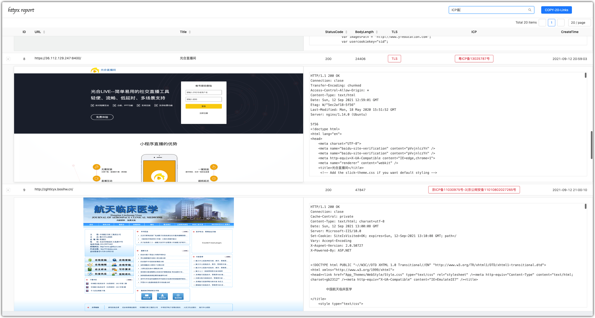

## 简介

> 判断 http/https 并截图

## Usage

```bash
Usage of ./httpx:
  -allow-jump
    	allow jump
  -chrome-path string
    	chrome browser path
  -disable-screenshot
    	disable screenshot
  -display-error
    	display error
  -headless-proxy string
    	chrome browser proxy
  -output string
    	output file name (default "202109121933.db")
  -proxy string
    	config probe proxy, example: http://127.0.0.1:8080
  -search string
    	search string from response
  -server
    	server output
  -silent
    	silent output
  -target string
    	target ip:port/scheme://ip:port
  -targets string
    	target ip:port/scheme://ip:port list file
  -thread int
    	config probe thread (default 10)
  -timeout int
    	config probe http request timeout (default 10)
  -uri string
    	specify uri for probe or screenshot
```

> example:

```bash
▶ cat domains.txt | ./httpx
```

```bash
▶ ./httpx -target http://xxx.xxx.xxx.xxx
```

```bash
▶ ./httpx -targets domains.txt
```

```bash
▶ ./httpx -output 202109112032.db -server # 启动服务并访问 http://127.0.0.1:9100/
```

## Screenshot

> 模板改自xray模板




