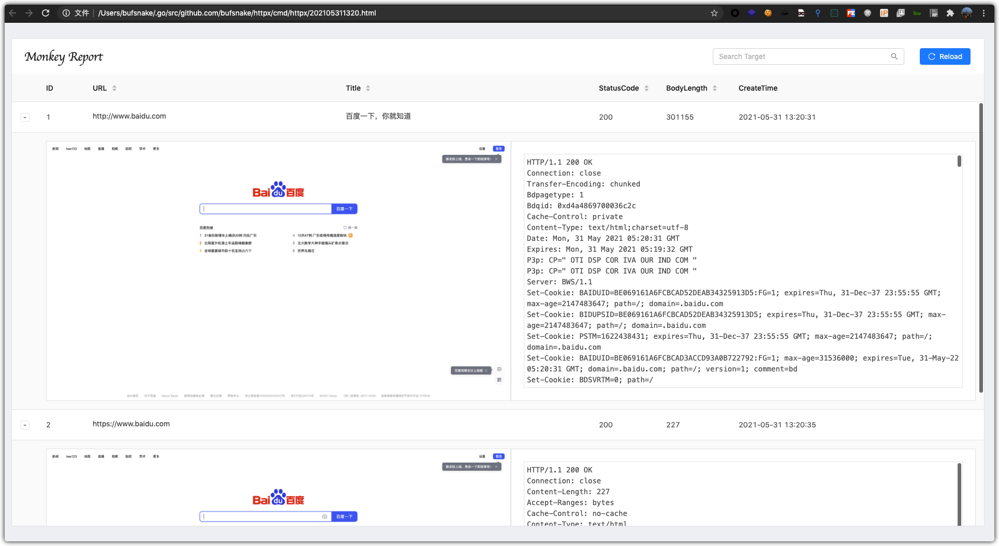

## 简介

> 判断 http/https 并截图

## Usage

```bash
└> ./httpx
Usage of ./httpx:
  -chrome string
    	chrome path (default "/opt/google/chrome/chrome")
  -output string
    	output file name (default "202105311320.html")
  -proxy string
    	probe proxy, example: http://127.0.0.1:8080
  -target string
    	target ip:port
  -targets string
    	target ip:port list file
  -thread int
    	probe thread (default 10)
  -timeout int
    	probe http request timeout (default 10)
```

## Screenshot



