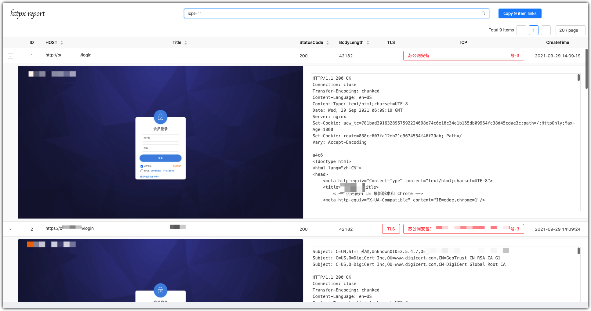

## 简介

> 判断 http/https 并截图

## Usage

```bash
-> % ./httpx -h
Usage of ./httpx:
  -D string
    	request body data
  -H value
    	specify request header, example:
    	-H 'Content-Type: application/json' -H 'Bypass: 127.0.0.1'
  -X string
    	request method (default "GET")
  -allow-jump
    	allow jump
  -chrome-path string
    	chrome browser path
  -cidr string
    	cidr file, example:
    	127.0.0.1
    	127.0.0.5-20
    	127.0.0.2-127.0.0.20
    	127.0.0.1/18
  -disable-screenshot
    	disable screenshot
  -display-error
    	display error
  -get-path
    	get all request path
  -get-url
    	get all request url
  -headless-proxy string
    	chrome browser proxy
  -output string
    	output database file name (default "202110081729")
  -path string
    	specify request path for probe or screenshot
  -port value
    	specify port, example:
    	-port 80 -port 8080
  -proxy string
    	config probe proxy, example: http://127.0.0.1:8080
  -rebuild
    	rebuild data table
  -server
    	read the database by starting the web service
  -silent
    	silent output
  -target string
    	single target, example:
    	127.0.0.1
    	127.0.0.1:8080
    	http://127.0.0.1
  -targets string
    	multiple goals, examlpe:
    	127.0.0.1
    	127.0.0.1:8080
    	http://127.0.0.1
  -thread int
    	config probe thread (default 10)
  -timeout int
    	config probe http request timeout (default 10)
```

> example:

```bash
▶ cat domains.txt | ./httpx
```

```bash
▶ ./httpx -target http://127.0.0.1
```

```bash
▶ ./httpx -targets domains.txt
```

```bash
▶ ./httpx -output TEST.db -server # 启动服务并访问 http://127.0.0.1:9100/
```

## 逻辑查询

📢: 正常查询字符串时，必须添加""

> 支持五个字段的查询

```bash
host
title
tls
icp
body
```

> 逻辑

```bash
&&
||
```

> 使用 () 和 && || = == != ~= ~!=符号

```bash
()
&&
||
=
==
!=
~=
~!=
```

### example

- host="127.0.0.1" && body="test"
- (icp="京" || icp="沪") && title="404"

## Screenshot

> 模板改自xray模板




## TODO

- [x] JSFinder 获取页面内完整链接
- [x] goquery 获取页面内完整链接 form、a、script、link、img(使用无头进行获取，全局枚举包含href、action、src属性的标签，并提取值)
- [x] 设置请求头

  - bypass via 127.0.0.1,可设置其他IP
- [x] 设置域名黑名单
- [x] 第一次启动Server时，重置Host顺序
- [ ] 一键Copy所有ICP
- [ ] 设置请求体
- [ ] 设置请求方式
