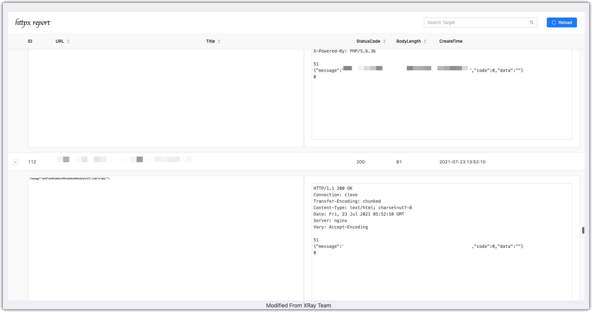
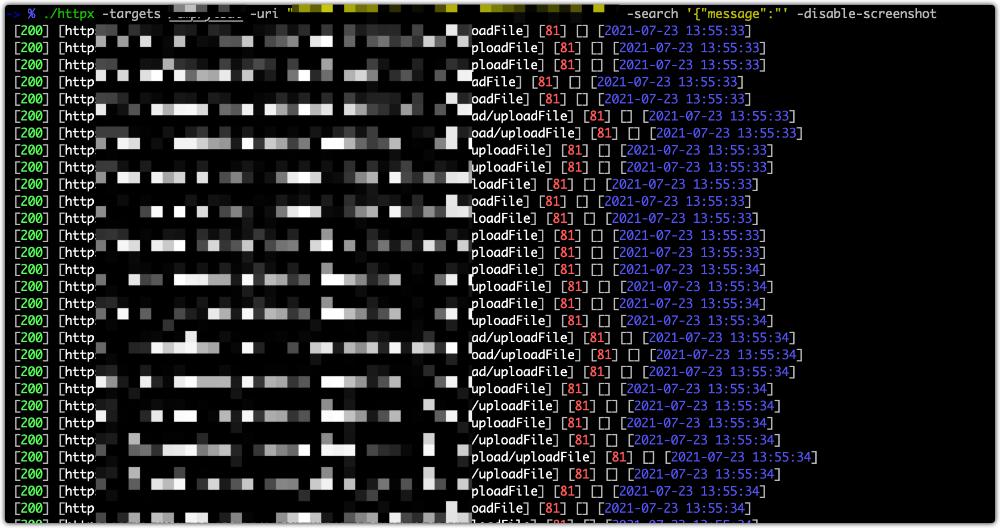

## 简介

> 判断 http/https 并截图

## Usage

```bash
-> % ./httpx
Usage of ./httpx:
  -chrome-path string
    	chrome browser path
  -disable-screenshot
    	disable screenshot
  -headless-proxy string
    	chrome browser proxy
  -output string
    	output file name (default "202107231356.html")
  -proxy string
    	config probe proxy, example: http://127.0.0.1:8080
  -search string
    	search string from response
  -target string
    	target ip:port/scheme://ip:port
  -targets string
    	target ip:port/scheme://ip:port list file
  -thread int
    	config probe thread (default 10)
  -timeout int
    	config probe http request timeout (default 10)
  -uri string
    	specify uri for probe or screenshot
```

## Screenshot

> 模板改自xray模板




